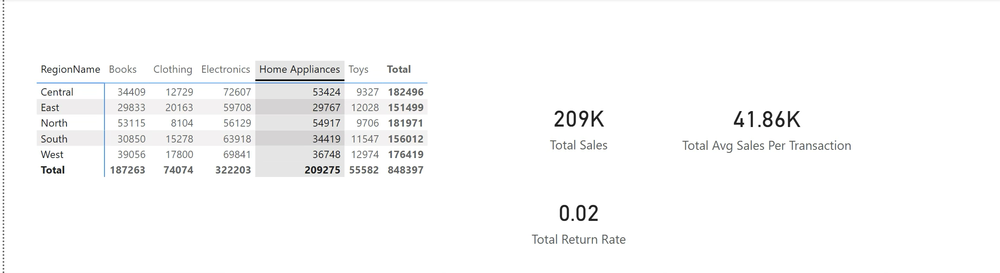

# 📊 Power BI DAX Project – Sales Analysis

## 📌 Project Overview
This project is built using Microsoft Power BI to analyze sales data using DAX (Data Analysis Expressions).
It includes calculated columns, measures, time intelligence, and matrix-based analysis.

## 📁 Dataset Tables
- Sales_Fact  
- Returns_Fact  
- Customer_Dim  
- Product_Dim  
- Date_Dim  
- Region_Dim  

## ⚙️ Features Implemented

### 🔹 Calculated Columns
- Profit = SalesAmount - Cost  
- ReturnFlag (Returned / Not Returned)  
- Customer Full Name  

### 🔹 Measures
- Total Sales  
- Total Cost  
- Total Profit  
- Return Rate (%)  
- Average Sale per Transaction  

### 🔹 Time Intelligence
- Year-over-Year (YoY) Growth  
- Previous Month vs Current Month Difference  
- Year-To-Date (YTD) Sales  
- Running Total  

### 🔹 DAX Functions Used
- SUM, AVERAGE, MAX  
- COUNTX, DISTINCTCOUNT  
- IF, AND, OR, SWITCH  
- CALCULATE, FILTER, ALL  
- RELATED  
- TOTALYTD, SAMEPERIODLASTYEAR, DATESBETWEEN  
- SUMX, AVERAGEX  

## 📊 Visualization
- Only Matrix Visual used
- Grouped by Region, Month, Product Category, Customer Segment  

## 📸 Output
- All Results are displayed in a Structured Matrix View With:
- Subtotals
- Grand Totals
- Time-based Comparison

  
## 📂 Project File
- .pbix file included  

## 🚀 How to Use
1. Open the .pbix file in Power BI Desktop  
2. Refresh data  
3. View the Matrix visual  

## 👤 Author
Jenish Patel
